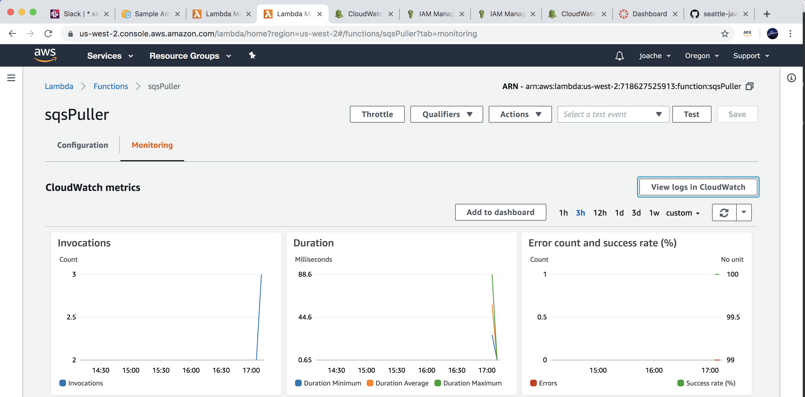
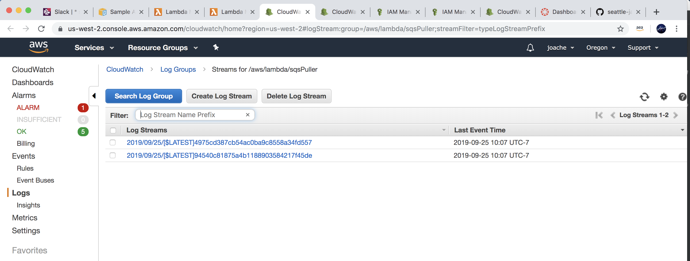
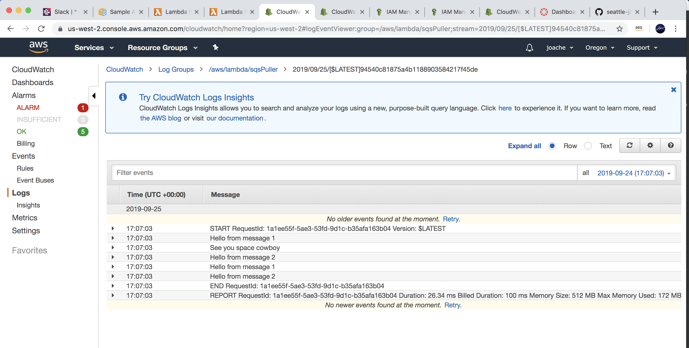
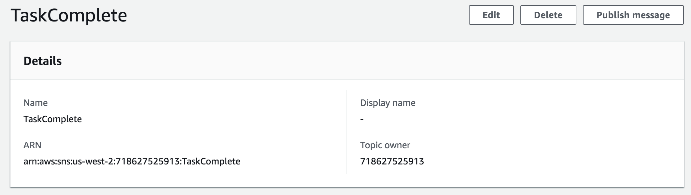
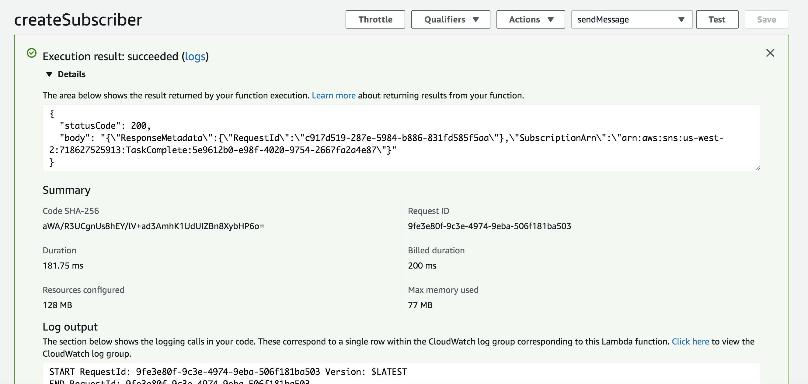
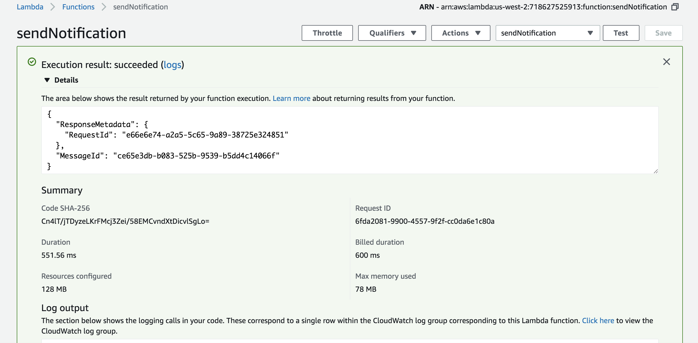
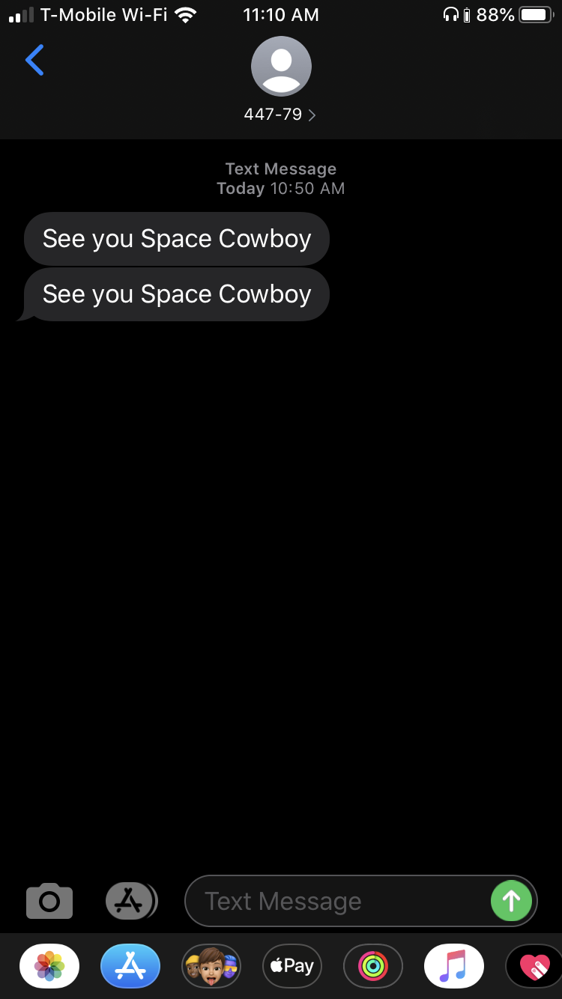

# Queues

## Feature Tasks : Lab 36 Message Queues

- Create 3 Standard Queues
    - QueueA
    - QueueB
    - QueueC
- Create command line applications in Java that use these queues
    - Queue Publisher
    - Sends a message to a queue, using its ARN or URL
    - Queue Client
    - Receives messages from a Queue (by ARN) and displays them
## Feature Tasks : Lab 37 SQS with Lambda

- Create Lambda functions that are triggered by each of the 3 Queues
- Write your functions in Javascript
    - They should perform the same task that your Java apps do
- Confirm that as you publish, you are seeing your app and the lambdas handle the queued messages at scale

## Feature Tasks : Lab 38: SNS Notifications

- Create an SNS Topic
    - Name this topic “TaskComplete”
- Create a Lambda function that creates a subscriber
    - The lambda function should take in a phone number as the event parameter
    - This phone number should be registered as an “SMS” subscriber to your topic
- Create a Lambda function that triggers a notification
    - This lambda function should publish a message to your topic
    - Once published, SNS should then send a text message to the the subscriber you created in the previous step
    
## Code
- [Github - Logger](https://github.com/JBusch2010/queues/tree/master/logger/src)
- [Github - SQS](https://github.com/JBusch2010/queues/tree/master/sqs/src)

## Credits Contributions
- https://github.com/awsdocs/aws-doc-sdk-examples/blob/master/java/example_code/sqs/src/main/java/aws/example/sqs/SendReceiveMessages.java
- https://docs.aws.amazon.com/lambda/latest/dg/with-sqs-create-package.html
- Brandon Hurrington
- Nhu Trinh
- Jackie
- Matt Stuhring
- Renee Messick
- Nicholas Paro
- Sapana Poudel 
- Travis Cox
- Chris Coulon
- Marisha Hoza
- Jack Kinne
- Melfi Perez
- Padmapriva Ganapathi

## Screenshots

#### Lambda Monitoring

#### CloudWatchLogs1

#### CloudWatchLogs2

#### TaskComplete SNS

#### Subscriber

#### Publisher

#### Text

